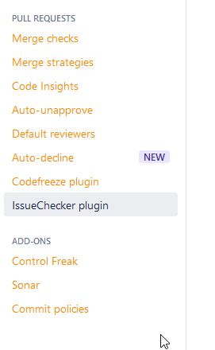
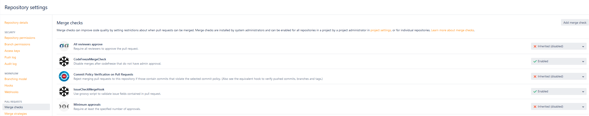
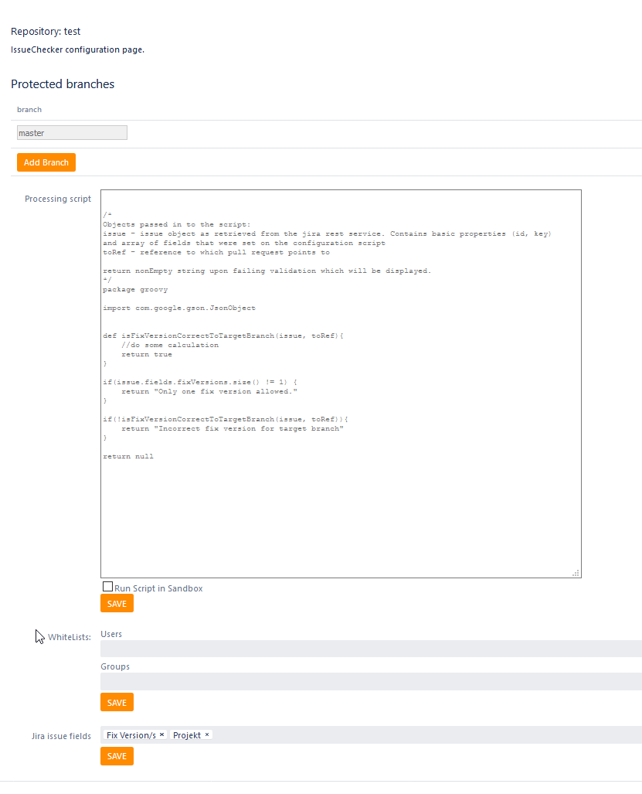
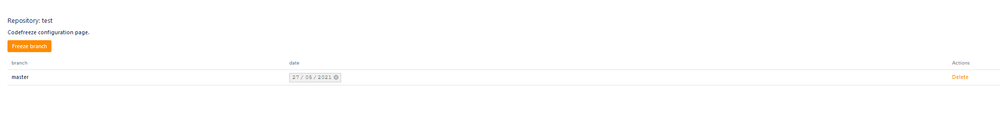
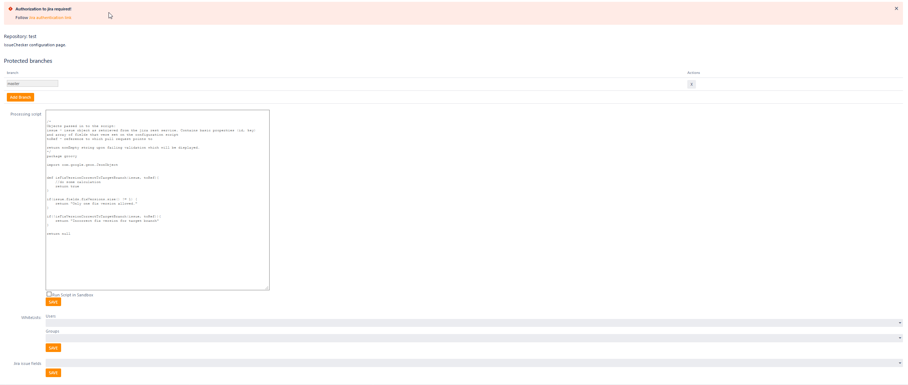

# Codefreeze

## Documentation

*Codefreeze* is a basic plugin for [Atlassian Bitbucket](https://www.atlassian.com/software/bitbucket) that allows you ahead of time set date from which pushing directly to specified branches is no longer possible.

In order to enable the *Codefreeze* settings page one of two hooks should be enabled on project or repository level:
- MergeCheck:
  - CodeFreezeMergeCheck: allows merges of pull requests only after admin review of the change
  - IsIssueKeyCorrect: executes a groovy script for every Jira ticket contained inside the pull request
- Hooks:
  - CodeFreezePrePushHook: blocks pushing to specified branches after specified date
  - IsIssueKeyCorrect: executes groovy script to evaluate the correctness of a Jira Issue, checks across all available fields

The branch name in the settings will be checked against ref name by "contains" function, which means that the master will apply restriction to branches such as `/8/1/0/master`, `/master/test` and so on.

An example for a groovy script can be found in the file `scr/test/resources/groovy/ParseScript.groovy`.

## Configuration
Settings can be found either on the left side panel of the repository page or inside repository settings.

The merge checks page looks like:

The issue checker is configured as follows:

A code freeze can be configured the following way:

The authorization needs to be defined in JIRA:

# Open Issues
- Reinit the Github task https://github.com/baloise/open-source/issues/117

## Hints for Developing Plugins

Here are the SDK commands you'll use immediately:

* `atlas-run`:  installs this plugin into the product and starts it on localhost
* `atlas-debug`:  same as `atlas-run`, but allows a debugger to attach at port 5005
* `atlas-cli`:  after `atlas-run` or `atlas-debug`, opens a Maven command line window: `pi`
                   re-installs the plugin into the running product instance
* `atlas-help`: prints description for all commands in the SDK

The full documentation is available at [Introduction to the Atlassian Plugin SDK](https://developer.atlassian.com/display/DOCS/Introduction+to+the+Atlassian+Plugin+SDK)

An example plugin can be found at https://bitbucket.org/atlassian/bitbucket-server-example-plugins.

For locating web elements suffix address with `?web.items&web.panels&web.sections`.

Follow the link [Best practices for active objects](https://developer.atlassian.com/server/framework/atlassian-sdk/best-practices-for-developing-with-active-objects/)
to obtain further best practices.

The DB access must be configured using the following JDBC URL:

`jdbc:h2:file:[pluginfolderpath]\target\bitbucket\home\shared\data\db;AUTO_SERVER=TRUE`

You can find an AUI soy template at:
* https://bitbucket.org/atlassian/aui/src/auiplugin-5.0-m26-stash/auiplugin/src/main/resources/soy/atlassian/form.soy?fileviewer=file-view-default
* https://developer.atlassian.com/server/bitbucket/reference/soy/branch-selector-field/

The API is used with the following URL structure:

`{host}/{app}/rest/{pathOfRest}/{versionOfRest}/{pathDefinedInClass)`

Example:

`localhost:7990/bitbucket/rest/codefreeze/1.0/projects/PROJECT_1/repos/rep_1/branchfreeze`

## Open Source
This project is open source and follows the [Baloise Open Source Guidelines](https://baloise.github.io/open-source/docs/arc42/).
